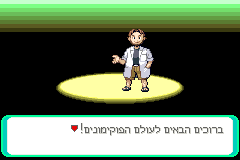
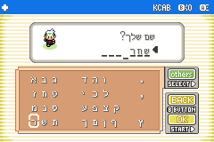
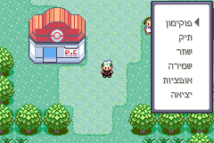

# Pokémon Bareket

This is a decompilation of Pokémon Emerald. It is currently being modified to allow Hebrew language compatibility, and later translated to Hebrew.

If you'd like to contribute coding or Hebrew translations, please do contact me on Discord (I'm shachar700) with a purposeful message.

It builds the following ROM:

* [**pokeemerald.gba**](https://datomatic.no-intro.org/index.php?page=show_record&s=23&n=1961) `sha1: f3ae088181bf583e55daf962a92bb46f4f1d07b7`

To set up the repository, see [INSTALL.md](INSTALL.md).

For contacts and other pret projects, see [pret.github.io](https://pret.github.io/).

## TODO
Technical work (20%)
- Numbers logic implementation
- Align Menus (Battle, Pokemon Summary, Bag, PokeDex, Road signs, Choiceboxes)

Translation (1%)

## Screenshots

